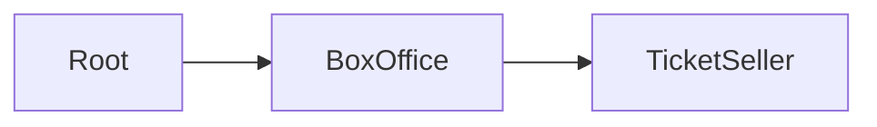
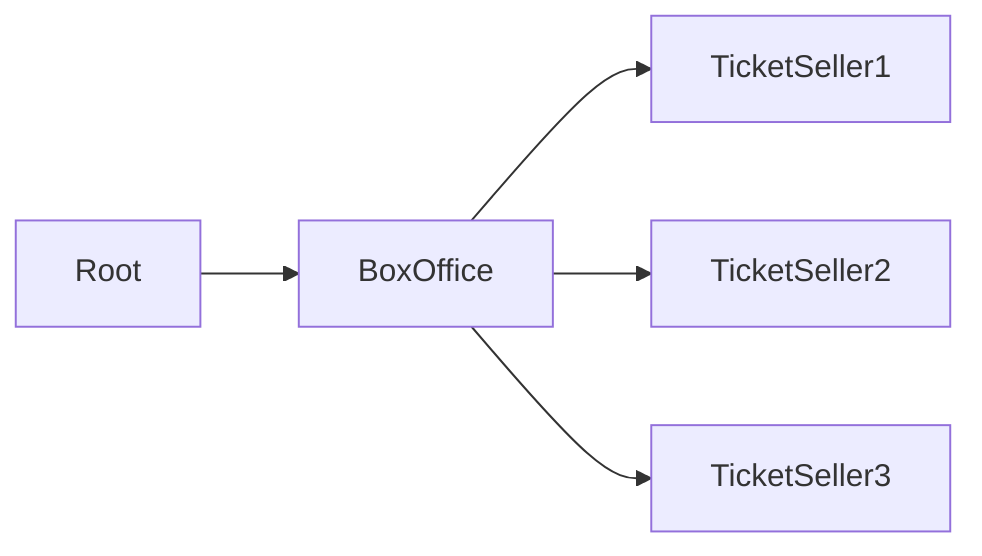

# phluxor-http-application-samples

## BoxOffice / Ticket Seller 

such a simple example of a ticket seller application.  

A sample similar to the akka in action book.

requires PHP 8.3 or later, and swoole extension.

## 概要

アクターは下記の通りです。



Box Officeがチケット販売を行い、Ticket Sellerがチケットを作成します。  
Ticket Sellerはイベントごとに存在します。  
これらはすべて並行して動作し、それぞれのアクターは隔離されています。  




場合によってはTicket SellerからBoxOfficeを経由せずにRootに直接メッセージを送ることもあります。  

## boot application

```bash
# example
$ ./vendor/bin/laminas mezzio:swoole:start -w 1
```

サーバはデフォルトで8080ポートで起動します。

[config](/config/autoload/swoole.local.php)

### チケット作成

好きなイベントのチケットを作成しましょう  
イベント名をパスで指定し、ticketsに作成するチケットの枚数を指定します。

好きなだけチケットを作ってください。  
ただし同じイベント名のチケットは作成できません。  
アクターが重複をチェックしています。

*チケットはメモリに保存されますので、停止すると消えます*

```bash
$ curl --request POST \
  --url http://127.0.0.1:8080/events/frank_zappa_live1985 \
  --header 'Content-Type: multipart/form-data' \
  --form tickets=40
```

### 全てのチケット取得

作成されたチケットを取得します。  
イベント名とチケット枚数が返ってきます。

```bash
$ curl --request GET \
  --url http://127.0.0.1:8080/events
```

### 単一のチケット取得

作成されたチケットを一件取得します。

```bash
$ curl --request GET \
  --url http://127.0.0.1:8080/events/frank_zappa_live1985
```

### チケット販売の停止

作成済みのチケットを削除します

```bash
$ curl --request DELETE \
  --url http://127.0.0.1:8080/events/frank_zappa_live1985
```
